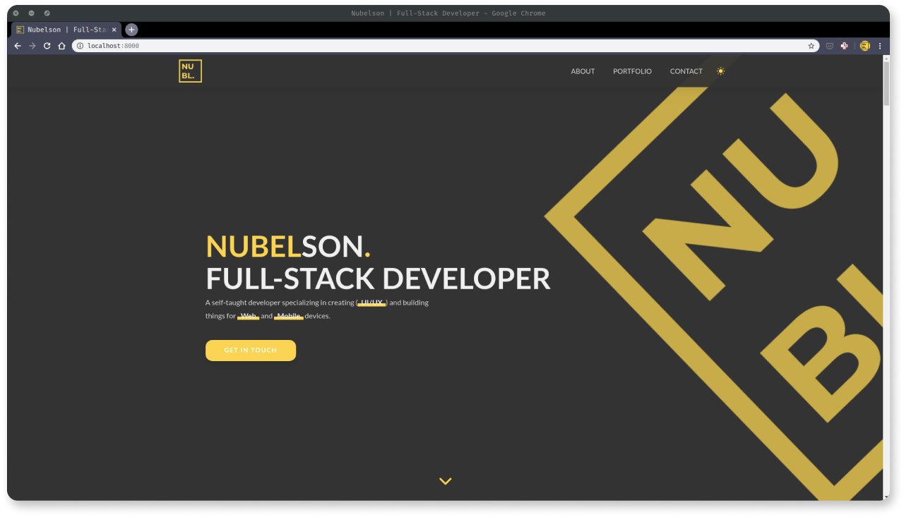

# Nubelson Portfolio



This very website you're now watching. I wanted something fast and with good SEO for my portfolio, so a static website generator like Gatsby seemed like the best fit. It reads data from markdown files, so it's super easy for me to keep adding Portfolio items as I keep developing stuff. It also has a cool dark mode switch since I couldn't decide between a dark or light design.

I was inspired by the website of a Developer that I admire a lot but I'm already designing a new version entirely created by me.

## Getting Started

These instructions will get you a copy of the project up and running on your local machine for development and testing purposes. Feel free to deploy if you want.

### Installation

Clone the repository and run

```javascript
// With Yarn
$ yarn install
$ gatsby develop
```

## Built With

-   [Gatsby](https://www.gatsbyjs.org/)
-   [ReactJS](https://reactjs.org/)
-   [Styled Components](https://styled-components.com/)
-   [GraphQL](https://graphql.org/)

## Contributing

Please feel free to send pull request if you want to contribute!

## Authors

-Nubelson - _Development_ - [nubelsondev](https://github.com/nubelsondev)
